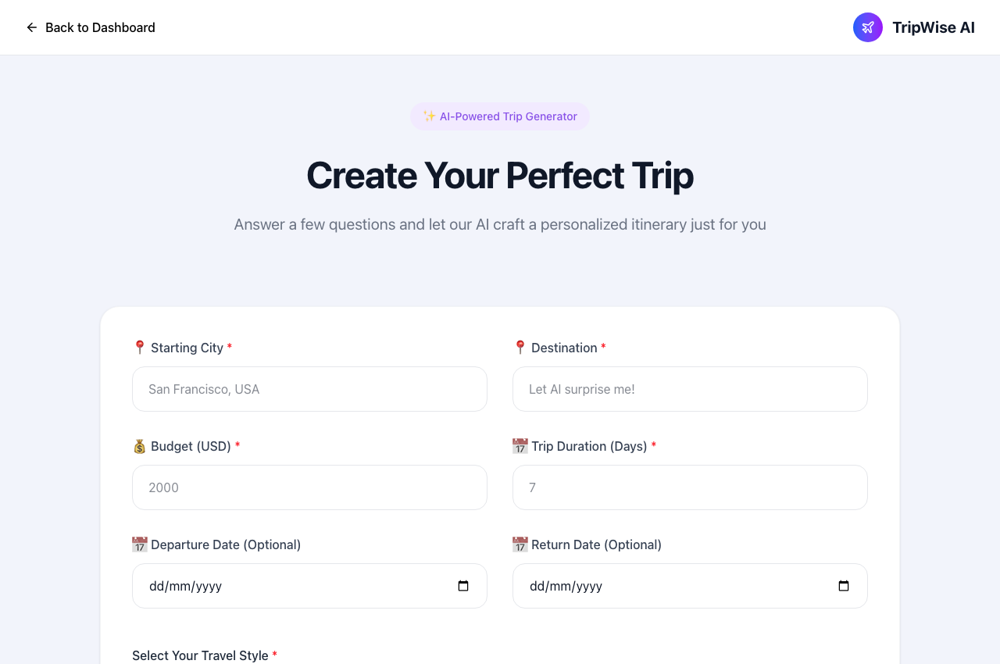
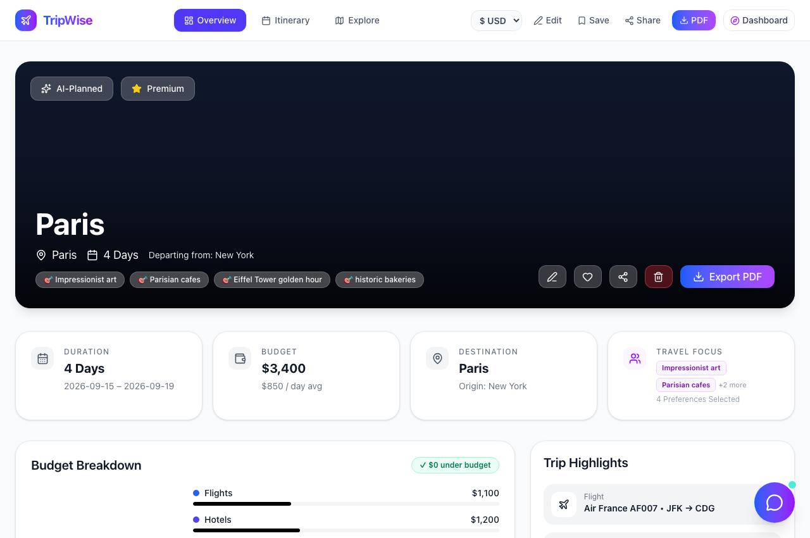
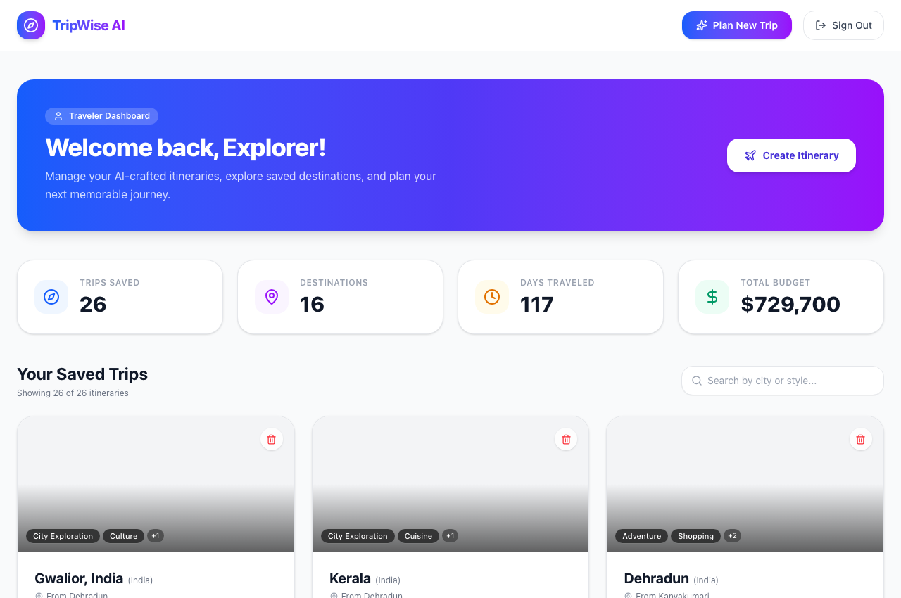

# TripWise AI

TripWise AI is a full-stack web application that helps users plan trips. By entering a destination, duration, budget, and travel preferences, the app creates a day-by-day itinerary, displays local weather forecasts, shows places on a map, and tracks estimated expenses.

I built this project to learn full-stack web development using React, Node.js, Express, SQLite, and external APIs.

---

## 📸 Screenshots

### 1. Home Page


### 2. Trip Generator Form


### 3. Trip Overview & Budget Breakdown


### 4. Traveler Dashboard & Saved Trips


---

## ❓ What Problem Does It Solve?

When planning a trip, people often have to switch between multiple websites:
- Travel blogs to find places to visit
- Map apps to see where attractions are located
- Weather websites to check temperatures
- Notes apps or spreadsheets to calculate estimated costs

TripWise AI brings these together in one place so a user can get a basic travel plan quickly.

---

## 👤 What Can a User Do?

1. **Pick a Destination**: Choose from a searchable city dropdown or type in another city.
2. **Set Preferences**: Choose trip duration, budget, travel style, and categories like culture, adventure, food, or relaxation.
3. **View Itinerary**: See morning, afternoon, and evening activities with approximate times and descriptions.
4. **Inspect Weather**: See current conditions and a 7-day forecast for the destination.
5. **Explore on a Map**: View destination coordinates and landmarks on an interactive map.
6. **Check Budget**: See an estimated breakdown for flights, hotels, food, transport, and activities.
7. **Ask the Concierge**: Chat with a simple AI assistant modal for local tips and packing suggestions.
8. **Save Trips**: Save trips to view, search, or delete later on the dashboard.

---

## ⚙️ How the Application Works

Here is how data flows through the app:

1. **Frontend (React + Vite)**:
   - The user fills out the trip form in React.
   - City search checks a local list of popular cities first. If the city is not in the list, it queries a geocoding service.
   - When the user submits the form, the frontend sends a POST request to `/api/trips/generate`.

2. **Backend (Node.js + Express)**:
   - The Express server receives the request and validates the fields.
   - It calls the Google Gemini API with a structured prompt asking for JSON with day-by-day activities and cost estimates.
   - If the Gemini API key is missing or an API call fails, the server uses a built-in fallback itinerary so the app still returns a usable trip.
   - The server saves the trip details into a local SQLite database.

3. **Trip Display**:
   - The user is redirected to the Trip Details page.
   - Destination coordinates are passed to Leaflet to display the map.
   - The frontend requests weather from the backend (`/api/weather`), which queries the Open-Meteo API using the coordinates.

---

## 💻 Tech Stack

- **Frontend**: React 18, Vite, Tailwind CSS, Lucide React (icons), Leaflet & React-Leaflet (maps), Recharts (budget chart), React Router DOM
- **Backend**: Node.js, Express, `node:sqlite` (built-in SQLite module in Node)
- **External APIs**:
  - Google Gemini API (for itinerary generation and concierge chat)
  - Open-Meteo API (free weather forecasts by coordinates)
  - OpenStreetMap / Nominatim (city geocoding)
  - Unsplash API (destination images, with local fallback images)

---

## 🚀 How to Install and Run Locally

### Prerequisites
- Node.js (v18 or higher recommended)
- npm

### 1. Clone the Repository
```bash
git clone https://github.com/saumyapant-dev/TRIPWISE-AI.git
cd TRIPWISE-AI
```

### 2. Set Up Environment Variables

**Backend (`server/.env`):**
```bash
cp server/.env.example server/.env
```
Open `server/.env` and add your Gemini API key (optional if using fallback itineraries):
```env
PORT=5001
GEMINI_API_KEY=your_gemini_api_key_here
```

**Frontend (`.env`):**
```bash
cp .env.example .env
```
*(Leave blank or keep `/api` so Vite proxies requests to the backend).*

### 3. Install Dependencies

Install frontend dependencies:
```bash
npm install
```

Install backend dependencies:
```bash
cd server
npm install
cd ..
```

### 4. Run Both Servers

Start the backend (Terminal 1):
```bash
cd server
npm run dev
# Server starts at http://localhost:5001
```

Start the frontend (Terminal 2):
```bash
npm run dev
# Frontend starts at http://localhost:5173
```

Open `http://localhost:5173` in your browser.

---

## 🔑 Environment Variables

| Variable | Location | Description | Required? |
| :--- | :--- | :--- | :--- |
| `PORT` | `server/.env` | Port for Express server (default: `5001`) | No |
| `GEMINI_API_KEY` | `server/.env` | Google Gemini API key for dynamic AI generation | Optional (fallback itineraries work without it) |
| `DATABASE_PATH` | `server/.env` | Path to the SQLite database file (default: `./src/data/tripwise.db`) | No |
| `UNSPLASH_ACCESS_KEY` | `server/.env` | Unsplash API key for photos | Optional (uses fallback photos if unset) |
| `VITE_API_BASE_URL` | `.env` | Frontend API base URL (default: `/api`) | No |

---

## 📖 How to Use the Application

1. Open `http://localhost:5173` and click **"Generate My Trip"** or navigate to **"Plan Trip"**.
2. Select your destination city from the dropdown. You can also filter by country or type any city name.
3. Enter your budget in USD, trip duration in days, and select travel style and preferences.
4. Click **"Generate Itinerary"**.
5. Once generated, explore the day-by-day plan, look at the map, inspect the 7-day weather forecast, and check the budget breakdown.
6. Click **"Save"** to store the trip in your dashboard.
7. Open the **Dashboard** at any time to review or remove past trips.

---

## 🧠 What I Learned While Building This Project

- **Separation of Concerns**: Keeping third-party API keys on the Express backend instead of the frontend React bundle so keys are not exposed to users.
- **Relational Data in SQLite**: How to design relational tables (`trips`, `itinerary_days`, `activities`, `budget_breakdown`) using foreign keys and transactions with Node's native `node:sqlite`.
- **Handling API Fallbacks**: How to handle external service failures gracefully by providing fallback data so the user experience doesn't break when an API key is missing or quota runs out.
- **Client-Side Debouncing**: Using a 320ms debounce on search inputs to avoid sending unnecessary requests while a user is typing.
- **Working with Coordinates**: Connecting geocoded latitude and longitude to both an interactive map (Leaflet) and a meteorological forecast API (Open-Meteo).

---

## ⚠️ Known Limitations

- **Local SQLite File**: The database runs in a local SQLite file on the server. If the server is restarted on a platform with ephemeral storage (like Vercel), stored data may reset unless using persistent disks or an external database like PostgreSQL.
- **Free-Tier API Rate Limits**: Free Gemini and OpenStreetMap Nominatim endpoints have rate limits. Searching too rapidly may temporarily delay geocoding results.
- **AI Hallucinations / Estimates**: Budget figures and activity schedules generated by AI are estimates and should be verified before real-world travel.
- **Simple Authentication**: The current sign-up and login features use basic password hashing and local storage for demonstration purposes. It does not currently use signed JWT tokens or session cookies.
- **Itinerary Editing**: Currently, users can view and delete saved trips, but editing individual activity times directly inside an existing itinerary is limited.

---

## 🔮 Possible Future Improvements

- **User Accounts with OAuth**: Add Google or GitHub sign-in alongside password authentication.
- **PDF Export**: Generate a clean, printable PDF version of the itinerary.
- **Multi-City Support**: Support itineraries that span multiple cities or stops.
- **Custom Activity Editing**: Allow users to drag, drop, edit, or add custom activities directly into the daily timeline.
- **Expanded City Catalog**: Add more regional destinations and points of interest.

---

## 🛡️ License

This project is licensed under the [MIT License](LICENSE).
